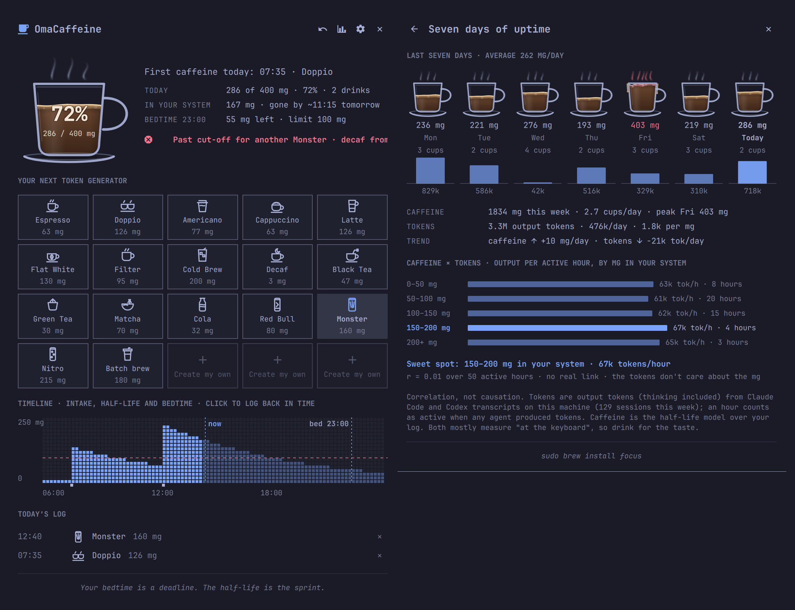

# OmaCaffeine

**Made with love for coders, coffee and Omarchy.**

A coffee glyph in your Omarchy bar. Click it and a small tracker drops down:
log what you are drinking, watch a mug fill up towards your daily limit, and
see the latest time you can have one more cup and still sleep tonight. Peak
while you code, sleep when you should, and learn, over a week, how your
milligrams line up with the tokens your coding agents produce.

<p align="center">
  
</p>

## Install

```bash
omarchy plugin add https://github.com/sonderbydk/omacaffeine.git --enable
```

Requires Omarchy 4. No sudo or pkexec is required, nothing is downloaded at
runtime, and nothing leaves your machine.

## Why

Caffeine has a half-life of about five hours. The espresso at 16:00 is still
half there at 21:00 and a quarter there at 02:00. OmaCaffeine does that
arithmetic for you, all day, and turns it into three things you can act on:
how full you are, how much will still be in your blood at bedtime, and the
cut-off time for one more of your usual.

## What you get

**The cup.** A mug that fills with coffee as today's intake approaches your
daily limit, or, if you prefer, with what is in your system right now so it
drains between cups. Logging pours: a stream falls in, the surface swells and
settles, the number counts up. Past the limit it is a stack overflow: the
crema boils in your theme's urgent colour and drips run down the outside.

**One-click logging** of sixteen drinks, Espresso to Nitro, each with an
outline icon in your theme's colours. The last drink is highlighted; press
Enter, middle-click the bar icon or bind a hotkey to have it again.

**Your own drinks.** The "+ Create my own" tiles take a name, the mg and one
of 23 icons. Your espresso is a double? Right-click any preset and give it
your own mg; reset it later with one click.

**Forgot one?** Click the timeline where the cup should have been, pick the
drink, and it lands in the log at that time.

**The cut-off.** "Cut-off 15:40 for another Flat White", "Clear for bedtime",
or "Past cut-off · decaf from here". Set your bedtime and how much caffeine
may still be in your system when you go to bed; the model does the rest.

**The timeline.** A pixel graph of caffeine in your body: what today's cups
did so far, the predicted decay from now, the bedtime limit and bedtime
itself.

**The week.** Seven small cups with the mg and cups per day, the average, the
trend, and, under each day, the output tokens your coding agents produced
(read locally from Claude Code and Codex transcripts). A second chart groups
your active hours by how much caffeine was in your system and shows the tokens
per hour for each band, so you can find your sweet spot and see the
correlation. Correlation, not causation, and the page says so.

**Your clock, your units.** Times follow the Omarchy clock widget (24-hour
unless your clock shows AM/PM); weight is shown in pounds for imperial
locales. Every colour comes from your theme; only the coffee is brown.

**Nerd mode is always on.** The drink grid greets you with a fresh heading
("Choose your weapon, code warrior"), the week page is a "Weekly sprint
retrospective", and the footer serves a pun.

## The model

Caffeine follows first-order elimination: every drink decays independently
with the same half-life. The half-life depends on the activity setting
(5 h sitting, 4.75 h standing, 4.5 h moving); adults average about 5 hours
with a range of roughly 3 to 7. Each drink is treated as fully absorbed when
logged, which errs on the safe side for the cut-off.

Limits follow EFSA guidance: 400 mg per day (about 5.7 mg per kg) and 200 mg
per single dose carry no safety concern for healthy adults, and 100 mg close
to bedtime may affect sleep, which is where the default bedtime limit of
100 mg comes from. Tighten it in settings if you sleep lightly. None of this
is medical advice.

For a drink of `D` mg, a bedtime `B`, half-life `h` and bedtime limit `L`,
with `C` mg already projected at bedtime from earlier drinks, the cut-off is

```
t = B - h · log2( D / (L - C) )
```

when `D > L - C`; otherwise the drink fits at any time before bed.

## Keyboard and IPC

| Action | How |
| --- | --- |
| Open / close | click the bar icon, or `omarchy shell -q io.github.sonderbydk.omacaffeine toggle` |
| Log the latest drink again | middle-click the bar icon, Enter in the panel, or `omarchy shell -q io.github.sonderbydk.omacaffeine logLast` |
| Log a specific drink | `omarchy shell -q io.github.sonderbydk.omacaffeine log espresso` (any kind from `… drinks`, custom ones included) |
| Log back in time | `omarchy shell -q io.github.sonderbydk.omacaffeine logAt espresso 09:00` |
| Undo | `omarchy shell -q io.github.sonderbydk.omacaffeine undo` |
| Week page | `omarchy shell -q io.github.sonderbydk.omacaffeine week` |
| Edit a drink / create one | `omarchy shell -q io.github.sonderbydk.omacaffeine edit espresso` / `edit new` |
| Status line | `omarchy shell io.github.sonderbydk.omacaffeine status` |

A Hyprland binding for the espresso addict:

```lua
o.bind("SUPER + SHIFT + C", "Log espresso",
  "omarchy shell -q io.github.sonderbydk.omacaffeine log espresso")
```

## Files and privacy

- `~/.local/state/omacaffeine/log.json` — the drink log (last eight days).
- `~/.config/omacaffeine/drinks.json` — your own drinks and preset mg overrides.
- Settings live inline on the widget's entry in `~/.config/omarchy/shell.json`
  and can be changed with `omarchy bar set io.github.sonderbydk.omacaffeine bedtime 22:30`.
- The week page's token counts come from `~/.claude/projects/**/*.jsonl` and
  `~/.codex/sessions/**/*.jsonl`, read locally by the bundled `tokens.py`
  (Python 3, part of every Omarchy install). Only per-hour token totals are
  kept in memory; no transcript content is stored or sent anywhere.

## Developing

No build step. `dev/harness.sh` renders the components in a standalone
Quickshell window; `dev/model-test.js` is a Node smoke test for the model.
See `CLAUDE.md` for the layout and the deploy loop.

MIT licensed. Brewed with Claude Code.
